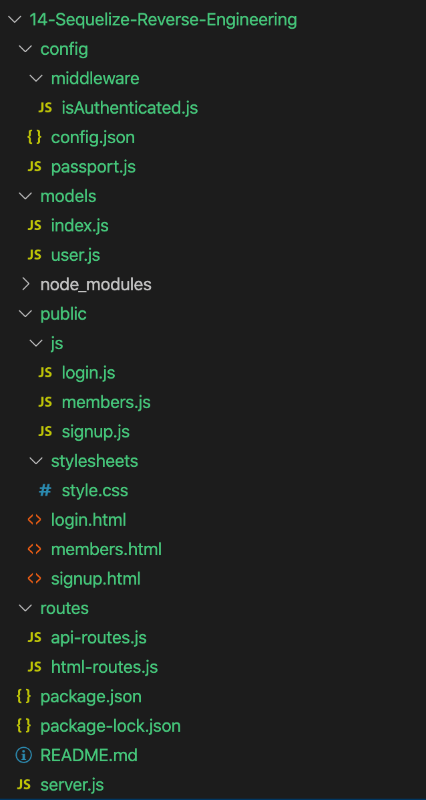
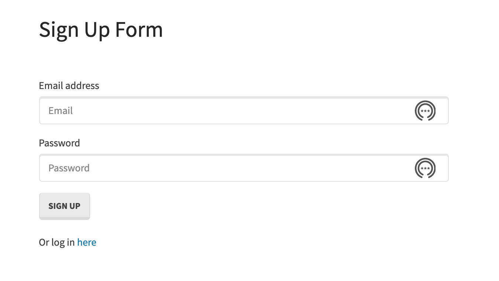
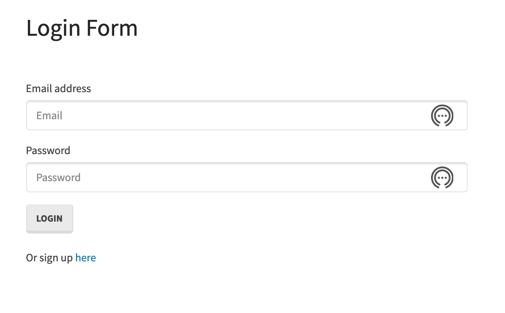
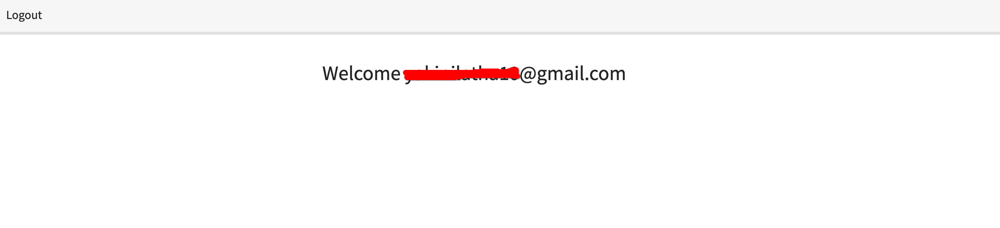

## Unit 14 Sequelize Homework: Reverse Engineering Code

This application involves the basic signup/login with MySQL, Node, Express and Sequelize.

1. If the user sign up, then the user is logged into the mainpage along with logout option.
2. If already an existing user then, login with email address and password and redirected to the main page.

### User Story 

As a user I can login to the website, so that I can use their service
In order to use their service, for NEW USER I need to SIGN UP and for ALREADY EXISTING USER I need to LOGIN.

### Prerequisite 

To execute the login application, the user must first install node JS
Steps to install Node JS: NodeJS Installation

After installing Node.js, to install NPM node module dependencies, run the command:
`NPM Install`

### NPM Module
 
Express - Express is a minimal and flexible Node.js application framework that provides a robust set of features for web and mobile applications. Used express server for this project and also sets up the express app to handle data parsing.
Mysql - Used mySQL method for connecting to the database and perform queries
Express-session - We need to save the user data between HTTP requests. Whenever the user makes a request from the same client again, we will have their session information stored with us (given that the server was not restarted). We can also add more properties to the session object.
Passport - Passport is Express-compatible authentication middleware for Node.js. Usually, we provide Passport a request to authenticate, and Passport provides hooks for controlling what occurs when authentication succeeds or fails.
Bcryptjs - Bcrypt uses a hashing algorithm to encrypt passwords before storing it in the database.

### Database

Create a database using the command:

DROP DATABASE IF EXISTS `passport_demo`;
CREATE DATABASE `passport_demo`;
USE `passport_demo`;

We are creating a table in Models -> User.js file using Sequelize. You can see a bit later on how index.js file is auto generated and use our User.js.

### Directory Structure

### Snapshots

### Link for Project Explanation

https://docs.google.com/document/d/1u0igkLRe6BeWs6wHkfHAEjA_0cLG74rdBVr_1Lm2hgI/edit?usp=sharing

### Questions

1. On signup page, it's not returning proper error message on browser just showing as `[Object Object]`
2. In login page, not showing error message on screen. While inspecting in network, it shows `401 Unauthorized`.
